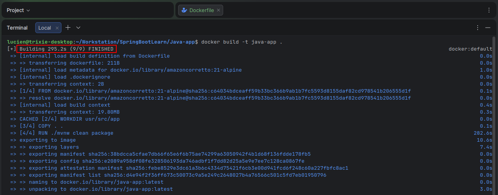
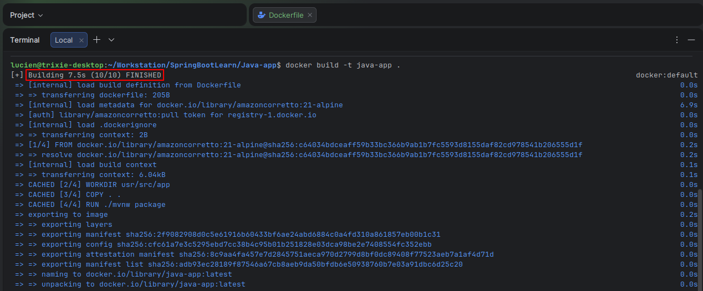
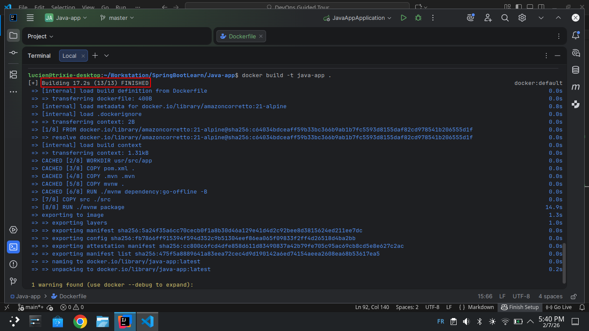

# Environnement de développement basé sur docker

Docker n’est pas seulement utile en production, il apporte aussi de nombreux avantages pour le **développement** :

- **Uniformité de l’environnement** : tout développeur utilise exactement les mêmes versions d'outils.
- **Pas de dépendances locales** : aucune librairie n’a besoin d’être installé sur la machine de l’utilisateur.
- **Isolation** : les builds et exécutions n’affectent pas la machine hôte.
- **Portabilité et collaboration** : un nouveau développeur n’a qu’à cloner le projet et lancer Docker pour démarrer.
- **Facilité de gestion des services** : bases de données, caches ou autres services nécessaires sont lancés rapidement via des containers.

## Optimisation d'un Dockerfile pour le développement avec Maven

Ce projet documente les étapes que j'ai pratiquées pour **optimiser le Dockerfile d'une application Java Maven** afin de travailler efficacement avec des conteneurs Docker en environnement de développement.

L'objectif principal était de **réduire le temps de build** lors des modifications fréquentes du code tout en gardant la possibilité d'avoir un build propre pour la production.

---

## 1. Point de départ

### Dockerfile initial

```dockerfile
FROM amazoncorretto:21-alpine
LABEL authors="lucien"
WORKDIR usr/src/app
COPY . .
RUN ./mvnw clean package
ENTRYPOINT ["java", "-jar", "target/Java-app-0.0.1-SNAPSHOT.jar"]
```
### Problèmes et limites

- ```COPY . .``` copie tout le projet, donc chaque changement entraine un rebuild complet, ce qui peut prendre trop de temps.

- ```RUN ./mvnw clean package``` :
   - Supprime le contenu du répertoire target avant compilation.
   - Garantit un build propre mais ralentit le développement car toutes les dépendances et le code sont recompilés à chaque fois.

### illustration


### Optimisation en développement

- Retirer le ```clean``` :

  ```RUN ./mvnw package```

- Effet :

  - Les fichiers compilés restent dans target.
  - Si le code n’a pas changé, le build est très rapide après le premier passage.

- Limite :
  - Risque de builds “sales” si des fichiers anciens persistent.
  - À éviter en production.

### illustration
Contrairement au premier cas, si rien n'est changé, le build ne prend plus trop de temps.


---
## 3. Compréhension des couches Docker

- Chaque instruction Docker (```COPY```, ```RUN```, etc.) crée une couche.
- Docker réutilise le cache pour les couches inchangées.

 Exemple :
- Si pom.xml ne change pas, la couche qui télécharge les dépendances peuvent être réutilisée.
- Seul le code source est recompilé si modifié.

### Séparation des dépendances et du code

- Copier d’abord pom.xml et télécharger les dépendances avant de copier le code source :
```dockerfile
FROM amazoncorretto:21-alpine
LABEL authors="lucien"
WORKDIR usr/src/app

# 1. copie de pom.xml et maven pour l'installation des dépendances
COPY pom.xml .
COPY .mvn .mvn
COPY mvnw .
RUN ./mvnw dependency:go-offline -B

# copie du code source de l'application
COPY src ./src
RUN ./mvnw package
FROM amazoncorretto:21-alpine
LABEL authors="lucien"
WORKDIR usr/src/app

# 1. copie de pom.xml et maven pour l'installation des dépendances
COPY pom.xml .
COPY .mvn .mvn
COPY mvnw .
RUN ./mvnw dependency:go-offline -B

# copie du code source de l'application
COPY src ./src
RUN ./mvnw package

ENTRYPOINT ["java", "-jar", "target/Java-app-0.0.1-SNAPSHOT.jar"]
ENTRYPOINT ["java", "-jar", "target/Java-app-0.0.1-SNAPSHOT.jar"]
```
### illustration
Seulement le premier build prend du temps,
À chaque fois qu'on modifie le code, tant que nous ne touchons pas aux dépendances on a un build rapide proche des performances réels.


Avantages :

- Docker réutilise la couche des dépendances si pom.xml n’a pas changé.
- Le build du code source est beaucoup plus rapide.
- Les plugins Maven nécessaires sont également téléchargés avec dependency:go-offline.
- Prépare un build hors ligne et reproductible.
- Possibilité de garder un build propre en production en ajoutant ```clean``` ou en créant une image multi-stage.

---
## 4. Résumé

### Concepts clés

- **Docker layers / cache** : chaque instruction crée une couche et Docker réutilise les couches inchangées.
- **Maven plugins vs dépendances** : plugins = outils Maven, dépendances = bibliothèques pour le projet.
- Optimisation Maven dans Docker : séparation des dépendances et code pour accélérer le développement.
- ```dependency:go-offline``` : télécharge tous les plugins et dépendances pour que le build soit rapide et reproductible.

### Sources utiles

- [Maven Dependency Plugin](https://maven.apache.org/plugins/maven-dependency-plugin/)
- [Maven Build Lifecycle](https://maven.apache.org/guides/introduction/introduction-to-the-lifecycle.html)
- [Dockerfile Best Practices](https://docs.docker.com/build/building/best-practices/)
- [Optimizing Maven builds in Docker](https://spring.io/guides/gs/spring-boot-docker)

### Résultat obtenu

- Un Dockerfile optimisé pour le développement Maven.
- Builds plus rapides, meilleure utilisation du cache Docker.
- Possibilité de maintenir un build propre pour la production en ajoutant ```clean``` ou en utilisant un multi-stage build.

---

### Remarques ou Contributions :

Pour tout apport ou correction à ce qui à été mentionner ici, veuillez me joindre au coordonnées suivantes :
- mail : lucienkiemde4@gmail.com
- [linkedin](www.linkedin.com/in/lucien-kiemde-a93179357)